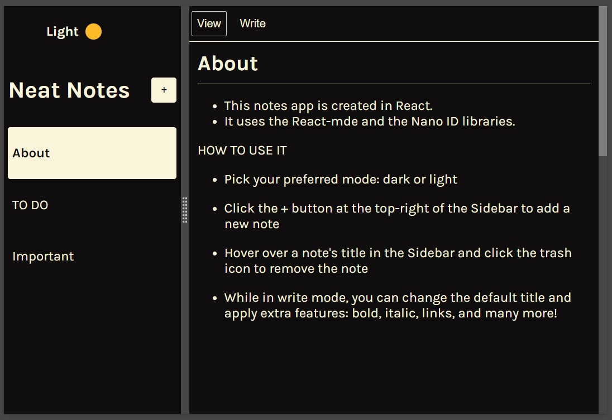

👋 **Hi, I'm Corina, a frontend developer with a background in math teaching.**
 
  My current work involves translating modern designs created by 
  [Frontend Mentor](https://www.frontendmentor.io) into accessible, responsive, and pixel-perfect websites.

Please visit **[my Frontend Mentor page](https://www.frontendmentor.io/profile/Cor-Ina)** to learn more about my work.
 I **WELCOME** questions about my code or suggestions on how to improve it,  especially on features related to accessibility.

 🛠 **My tools:**
- CSS, BEM
- A11y
- JavaScript
- Figma + Sketch

 📚 **Currently learning: React, Sass**

- Quick link to my current React project, **NEAT NOTES**, a Desktop notes app:

 Features I'm tinkering with:
- adding several font color options for the dark mode layout
- mobile-friendly design

 ♿️ **My favorite resources on learning about accessibility:**
  - [W3C Before and After Demonstration](https://www.w3.org/WAI/demos/bad/)
   It showcases an inaccessible website and a retrofitted version of the same website. 
   Each page includes inline annotations that can be activated to identify and
   highlight important accessibility barriers or the corresponding repairs made. 
  - [Duke University Accessibility pages](https://web.accessibility.duke.edu/how/web-development/)
  - [Harvard's Accessibility pages](https://accessibility.huit.harvard.edu/content-creators)
  - [Jon Kuperman's Website Accessibility course](https://frontendmasters.com/courses/accessibility-v2/) on Frontend Masters
                         
 👷 **I am open to collaborating on a11y / CSS / JavaScript / React projects.**
